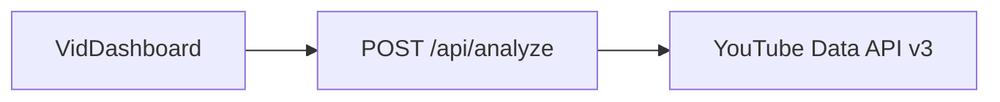

# VidMetrics — Competitor channel pulse

MVP for the VidMetrics hiring challenge: paste a **YouTube channel URL** (or `@handle` path) and inspect **recent uploads** with views, likes, comments, duration, and a **views-per-day** signal. Filtering defaults to **the current calendar month in UTC**; sort and refine on the client.

## Stack

- **Next.js 16** (App Router) + **TypeScript** + **Tailwind CSS v4**
- **YouTube Data API v3** (server-side only via `POST /api/analyze`)
- **Recharts** for a compact views bar chart

## Local setup

1. **Node.js 20+** recommended.
2. Copy environment template and add your API key:

   ```bash
   cp .env.example .env.local
   # edit .env.local — set YOUTUBE_API_KEY=...
   ```

3. Install and run:

   ```bash
   npm install
   npm run dev
   ```

4. Open [http://localhost:3000](http://localhost:3000).

### Google Cloud

1. Create a project, enable **YouTube Data API v3**, create an **API key**.
2. Restrict the key (recommended): limit to YouTube Data API v3; for browser/server-from-your-domain, add HTTP referrers for production and `http://localhost:3000/*` for development.

Detailed checklist: see [human_assistance_steps.md](./human_assistance_steps.md) (Vercel, GitHub, Loom, etc.).

## Architecture

- **`app/api/analyze/route.ts`** — Validates JSON body, reads `YOUTUBE_API_KEY`, calls `analyzeChannel`.
- **`lib/youtube.ts`** — Parses channel input (`UC…`, `@handle`, `/c/`, `/user/` + `search.list` fallback), loads up to **200** `playlistItems` from the uploads playlist, batches **`videos.list`** (50 IDs per call), normalizes metrics.
- **`components/VidDashboard.tsx`** — Client UI: filters (UTC date range, title, min views), sort (views / date / likes), **desktop table** + **mobile cards**, CSV export, “Top tier” badge for **top quartile of views/day** in the **current filtered** set.
- **`components/ViewsBarChart.tsx`** — Horizontal bar chart of top views in the filtered list.



## Product limits (honest)

- **No auth / rate limiting** on the demo API route (acceptable for an MVP; add Edge middleware + KV or a BFF quota in production).
- **Uploads list capped at 200** items per analysis to stay within sensible quota; UI notes when the list is truncated.
- **Search fallback** for `/c/` and `/user/` may pick the wrong channel if the name is ambiguous—prefer `@handle` or `/channel/UC…` for demos.

## AI-assisted workflow (for reviewers)

- Scaffolded with `create-next-app`, then iterated with AI on data plumbing (`lib/youtube.ts`), UI/UX polish, and docs.
- AI was used for API shape design, TypeScript types, and responsive layout; you manually verified behavior against real channels and **your own API key**.

## Scripts

| Command        | Purpose              |
| -------------- | -------------------- |
| `npm run dev`  | Development server   |
| `npm run build`| Production build     |
| `npm run start`| Serve production build |
| `npm run lint` | ESLint               |

## Challenge submission helpers

- [docs/SUBMISSION_CHECKLIST.md](./docs/SUBMISSION_CHECKLIST.md) — links and permissions to verify before sending.
- [docs/LOOM_OUTLINE.md](./docs/LOOM_OUTLINE.md) — ~5 minute talking points (camera on).
- [docs/WRITTEN_SUBMISSION_TEMPLATE.md](./docs/WRITTEN_SUBMISSION_TEMPLATE.md) — paste into Notion or export as PDF.

## License

Private / assessment use per employer instructions.
